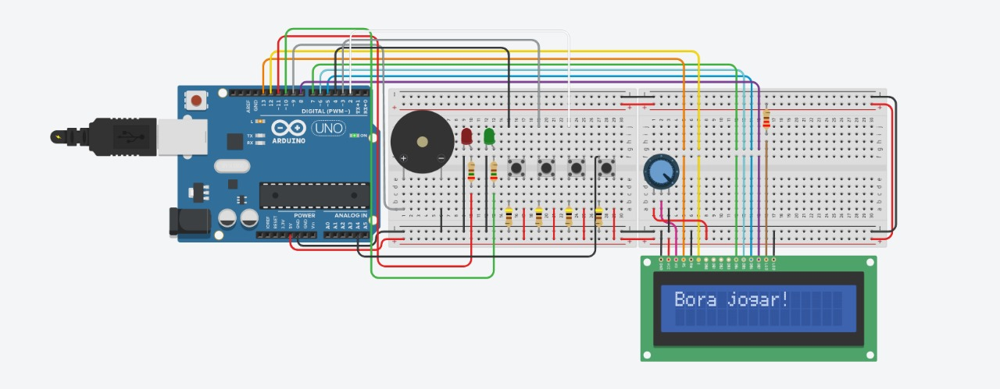

<p align="center">
  <a href="#-objetivo-">Objetivo</a> |
  <a href="#-itens-utilizados-">Itens Utilizados</a> |
  <a href="#%EF%B8%8F-passo-a-passo-do-jogo-%EF%B8%8F">Passo a Passo</a> |
  <a href="#-vídeos-">Vídeos</a> |
  <a href="#-autores-do-projeto-">Autores</a>
</p>

## 📈 Objetivo 📈

O objetivo do jogo de perguntas é oferecer uma experiência divertida e educativa aos jogadores, enquanto exploram seus conhecimentos em diversos temas. Com três níveis de dificuldade - fácil, médio e difícil - cada um com cinco perguntas e uma pergunta final, os jogadores têm a oportunidade de testar suas habilidades e aprender novos conceitos.

## 📚 Itens Utilizados 📚

### Tecnologias 👾

<div style="display: inline_block"><br>
  
    
</div>

### Materiais 🖌️

<div>
  <ul>
    <li>01 Arduino UNO</li>
    <li>02 LEDs</li>
    <li>04 botões</li>
    <li>07 Resistores</li>
    <li>01 Buzzer</li>
    <li>01 Display LCD 16x2</li>
    <li>02 Protoboards</li>
    <li>01 Potenciômetro</li>
  </ul>
</div>

### Código 👾

Optamos por incluir o código utilizado no projeto neste bloco para uma apresentação visual mais atraente, mas ele também está disponível no repositório.
<details>
  <summary>Código em C++</summary>

```cpp
#include <LiquidCrystal.h>

LiquidCrystal lcd(13, 12, 7, 6, 5, 8);

//Começamos definindo os pinos dos botões, leds e buzzer, 
//assim facilita a identificação no decorrer do código!
int botao_iniciar = 4;
int botao_sim = 2;
int botao_nao = A4;
int botao_pular = 3;
int led_verde = 10;
int led_vermelho = 11;
int buzzer = 9;

//Criamos arrays de perguntas e respostas para cada dificuldade, 
//gerando assim um banco de perguntas e suas respectivas perguntas!
String perguntas_faceis[] = {"1 + 1 = 2 ?" , "2 + 2 = 22 ?", "3 + 3 = 4 ?", "5 junto com 5 = 55 ?",
                             "6 - 9 = 3 ?", "3 - 3 = -3 ?", "1.5 + 1 = 2.5 ?", "0 + 0 = 0 ?"};
String perguntas_medias[] = {"1 + 1 + 5 - 1 =  -6 ?", "3 - 3 + 3 = 3 ?", " 0 - 1 + 9 = 8 ?",
                             "1 + 1 + 1 + 1 + 1 + 1 + 1 + 1 = 9 ?", "8 - 8 - 7 = -7 ?",
                             " 9 - 9 - 9 + 9 = 0 ?", " 0 + 0 = - 2 - 2 ?", "3 + 3 - 2 + 6 = 28?"};
String perguntas_dificeis[] = {"11 x 11 = 121 ?", "5 x 5 / 5 = 5 ?", "5 * 5 - 8 + 9 / 1 = 1 ?",
                               "2 * 2 + 2 = 8 ?", " 1 * 1 / 1 * 1 = 1 ?", " 5 * 6 - 7 + 8 = 31 ? ",
                               " 0 * 10 - 10 + 10 = -10 ?", " 60 + 60 / 60 = 2 ?"};
String pergunta_boss = "Tiramos 10?";

bool respostas_faceis[] = {true, false, false, true, false, false, true, true};
bool respostas_medias[] = {false, true, true, false, true, true, false, false};
bool respostas_dificeis[] = {true, true, false, false, true, true, false, false};
bool resposta_boss = true;

//Aqui criamos as variáveis de controle do jogo, 
//que definem algumas coisas básicas para nós, 
//como a quatidade de pulos, tentativas e algumas outras coisas.
int dificuldade = 0;
int acerto = 0;
int tentativa = 1;
int pulo = 4;
int pergunta_atual = 0;
unsigned long contagem_tempo_resposta;
const long tempo_resposta = 15000;
boolean jogo_iniciado = false;
int pontos = 0;
int numero_da_questao = 0;
String Isaac = "Selo Isaac de Aprovacao";

//Nesse ponto começamos a criar nossas primeiras configurações, 
//definindo pinos digitais e analógicos, para aos pinos que identificamos anteriormente, 
//podendo ser esses pinos de entrada ou saída
void setup() {
  lcd.begin(16, 2);
  pinMode(botao_iniciar, INPUT);
  pinMode(botao_sim, INPUT);
  pinMode(botao_nao, INPUT);
  pinMode(botao_pular, INPUT);
  pinMode(led_verde, OUTPUT);
  pinMode(led_vermelho, OUTPUT);
  pinMode(buzzer, OUTPUT);
  randomSeed(analogRead(0));
  lcd.print("Bora jogar!");
}

//Aqui temos o loop principal do jogo, é nele que verificamos se o tempo para responder acabou,
//Iniciar o jogo e desistir do mesmo, verificar se o jogo está iniciado ou não, 
//se ainda há pulos disponíveis e se houverem, é aqui que o pular pergunta acontece.
//Fora isso, é no loop que ainda temos a exibição dos pontos no LCD.
void loop() {
  if (digitalRead(botao_iniciar) == HIGH) {
    delay(200);
    if (!jogo_iniciado) {
      inicia_jogo();
    } else {
      desistir_jogo();
    }
  } else if (jogo_iniciado) {
    jogo_loop();
    verifica_tempo();
  }

  if (digitalRead(botao_pular) == HIGH && jogo_iniciado) {
    delay(200);
    pular_pergunta();
  }

  if(jogo_iniciado) {
    lcd.setCursor(0, 1);
    lcd.print("Pontos: ");
    lcd.print(pontos);
  }
}

//Aqui temos a função de início do jogo.
//Nessa função, temos leds indicadores do início do jogo, 
//o reinício das variáveis e a seleçao da primeira pergunta.
void inicia_jogo() {
  jogo_iniciado = true;
  //leds
  digitalWrite(led_vermelho, HIGH);
  delay(200);
  digitalWrite(led_vermelho, LOW);
  digitalWrite(led_verde, HIGH);
  delay(200);
  digitalWrite(led_verde, LOW);
  //variáveis reiniciadas e seleção da primeira pergunta
  dificuldade = 0;
  acerto = 0;
  tentativa = 1;
  pontos = 0;
  pulo = 4;
  pergunta_atual = 0;
  numero_da_questao = 1;
  seleciona_pergunta();
  apresenta_pergunta();
  contagem_tempo_resposta = millis();
}

//Essa função, por sua vez, faz com que haja desistência,
//Então assim que clicamos novamente no botão de iniciar,
//O Jogo automaticamente é "cancelado" e uma mensagem aparece no lcd.
//Após isso, o jogo reinicia.
void desistir_jogo() {
  jogo_iniciado = false;
  som_desistencia();
  lcd.clear();
  lcd.print("Fraco!");
  delay(2000);
  lcd.clear();
  lcd.print("Bora jogar!");
}

//Essa é a função chamada durante o jogo para a escolha da pergunta.
//Junto daquele "banco" de perguntas, essa função escolhe uma pergunta,
//Para ser apresentada em outra função.
//Aqui também há a troca das perguntas de acordo com a dificuldade.
void seleciona_pergunta() {
  switch (dificuldade) {
    case 0: pergunta_atual = random(0, sizeof(perguntas_faceis) / sizeof(perguntas_faceis[0])); break;
    case 1: pergunta_atual = random(0, sizeof(perguntas_medias) / sizeof(perguntas_medias[0])); break;
    case 2: pergunta_atual = random(0, sizeof(perguntas_dificeis) / sizeof(perguntas_dificeis[0])); break;
  }
}

//Essa é a função que apresenta a pergunta escolhida pela função anterior.
//Fora isso, também temos a impressão no led das duas opções de resposta (Sim e Não),
//A quantidade de pontos e em qual pergunta das 16, o player está.
void apresenta_pergunta() {
  jogo_iniciado = true;
  lcd.clear();
  mostra_pergunta_rolando();
  lcd.clear();
  lcd.print("Sim ou Nao?");
  lcd.setCursor(0, 1);
  lcd.print("Score:");
  lcd.print(pontos);
  numero_da_questao++;
  lcd.print("   Q:");
  lcd.print(numero_da_questao -1);
  contagem_tempo_resposta = millis();
}

//Essa função serve para que perguntas grandes, 
//Que ultrapassam o limite de 16 caracteres apresentáveis no lcd,
//Possam ser apresentadas roladno da direita para esquerda.
void mostra_pergunta_rolando() {
  String pergunta_completa = "";
  switch (dificuldade) {
    case 0: pergunta_completa = perguntas_faceis[pergunta_atual]; break;
    case 1: pergunta_completa = perguntas_medias[pergunta_atual]; break;
    case 2: pergunta_completa = perguntas_dificeis[pergunta_atual]; break;
    case 3: pergunta_completa = pergunta_boss; break;
  }

  if (pergunta_completa.length() <= 16) {
    lcd.print(pergunta_completa);
    delay(4000);
  } else {
    for (int i = 0; i < pergunta_completa.length() - 16; i++) {
      lcd.clear();
      lcd.print(pergunta_completa.substring(i, i + 16));
      delay(500);
    }
    delay(1000);
  }
}

//Aqui temos a validação do pressionamento do botão,
//Ou seja, ele interpreta o botão apertado e manda para outra função,
//O que o player respondeu, e nessa outra função, o jogo verifica se está correto.
void jogo_loop() {
  if (digitalRead(botao_sim) == HIGH) {
    delay(200);
    verifica_resposta(true);
  } else if (digitalRead(botao_nao) == HIGH) {
    delay(200);
    verifica_resposta(false);
  }
}

//Essa é a função que recebe a interpretação dos botões e verifica se está correta ou não, a resposta.
//Fora isso temos diferentes sons emitidos nas respostas corretas e incorretas.
//Temos leds indicadores de erro e acerto. Som emitido quando se perde o jogo, e a verificaçao das respostas,
//De acordo com a dificuldade. Fora o som emitido quando vencemos!
//Lembrando que todos esses sons são configurados em outras funções!
void verifica_resposta(bool resposta) {
  bool resposta_correta = false;
  if (dificuldade < 3) {
    switch (dificuldade) {
      case 0: resposta_correta = respostas_faceis[pergunta_atual]; break;
      case 1: resposta_correta = respostas_medias[pergunta_atual]; break;
      case 2: resposta_correta = respostas_dificeis[pergunta_atual]; break;
    }

    if (resposta == resposta_correta) {
      acerto++;
      som_acerto();
      pontos++;
      if (acerto >= 5) {
        dificuldade++;
        acerto = 0;
        if (dificuldade == 3) {
          lcd.clear();
          lcd.print(pergunta_boss);
        } else {
          seleciona_pergunta();
          apresenta_pergunta();
        }
      } else {
        seleciona_pergunta();
        apresenta_pergunta();
      }
    } else {
      som_erro();
      tentativa--;
      digitalWrite(led_vermelho, HIGH);
      delay(200);
      digitalWrite(led_vermelho, LOW);
      if (tentativa == 0) {
        jogo_iniciado = false;
        som_desistencia();
        lcd.clear();
        lcd.print("Ja era meu fi");
        delay(3000);
        return;
      }
      seleciona_pergunta();
      apresenta_pergunta();
    }
  } else if (dificuldade == 3) {
    if (resposta == resposta_boss) {
      som_vencer();
      jogo_iniciado = false;
      lcd.clear();
      lcd.print(Isaac);
      delay(1500);
      for (int i = 0; i < Isaac.length()-16; i++){
        lcd.scrollDisplayLeft();
        delay(500);
      }
    } else {
      som_erro();
      lcd.clear();
      lcd.print("Poxa Isaac...");
      delay(3000);
      jogo_iniciado = false;
    }
  }
  contagem_tempo_resposta = millis();
}

//Aqui temos a função que verifica o tempo para responder, e envia essa informação para o loop principal.
//Quando o tempo acaba, o jogo entende que a pergunta não foi respondida e portanto a resposta está incorreta.
//Com isso ele desconta a tentativa, essa que era única e portanto o jogo é perdido. E após isso, reiniciado.
void verifica_tempo() {
  unsigned long tempo_atual = millis();
  if (tempo_atual - contagem_tempo_resposta > tempo_resposta) {
    som_erro();
    tentativa--;
    if (tentativa == 0) {
      som_desistencia();
      jogo_iniciado = false;
      lcd.clear();
      lcd.print("Ja era meu fi");
      delay(3000);
      return;
    }
    seleciona_pergunta();
    apresenta_pergunta();
    contagem_tempo_resposta = millis();
  } else if (tempo_atual - contagem_tempo_resposta > tempo_resposta - 5000) {
    digitalWrite(led_vermelho, (millis() / 250) % 2);
  } else {
    digitalWrite(led_vermelho, LOW);
  }
}

//Função de configuração do buzzer para acerto
void som_acerto() {
  tone(buzzer, 1000, 200);
  digitalWrite(led_verde, HIGH);
  delay(200);
  digitalWrite(led_verde, LOW);
  noTone(buzzer);
}

//Função de configuração do buzzer para erro
void som_erro() { 
  tone(buzzer, 250, 200); 
  delay(300); 
  noTone(buzzer); 
}

//Função de configuração do buzzer para desistência
void som_desistencia() { 
  for (int i = 0; i < 3; i++) { 
  tone(buzzer, 200, 300); 
  delay(350); 
  } 
  noTone(buzzer); 
}

//Função de configuração do buzzer para quando vencer o jogo e led piscante indicando sucesso!
void som_vencer() {
  tone(buzzer, 523, 300);
  delay(300);
  tone(buzzer, 587, 300);
  delay(300);
  tone(buzzer, 659, 300);
  delay(300);
  tone(buzzer, 698, 300);
  delay(300);
  tone(buzzer, 784, 300);
  delay(300);
  noTone(buzzer);

  for(int i = 0; i < 10; i++) {
    digitalWrite(led_verde, HIGH);
    delay(100);
    digitalWrite(led_verde, LOW);
    delay(100);
  }
}

//Essa foi a última função arrumada e por isso ficou separada de todas as outras.
//Ela é a função que pula as perguntas, sendo no máximo 3 pulos, e se o player tentare uma quarta vez,
//Ele perde o jogo.
void pular_pergunta() {
  pulo--;
    if (pulo == 0) {
      som_desistencia();
      jogo_iniciado = false;
      lcd.clear();
      lcd.print("Ja era meu fi");
      delay(3000);
      return;
    } else {
      seleciona_pergunta();
      apresenta_pergunta();
    }
}
```
</details>

### Circuito Montado 🖌️
<div>
  
</div> 
<br>

Clique no botão e tenha acesso ao circuito ⬇️ 

<a href="https://www.tinkercad.com/things/7hIbVrCa4DK-projeto-final/editel?sharecode=hfgsll-JCRzcpZOkn3FswTL0HCJUgorU_o3cYWIUQLw">
  
</a>

## 🕹️ Passo a Passo do Jogo 🕹️

- Assim que o LCD ligar, o primeiro botão, da esquerda para direita deverá ser pressionado para que o `jogo inicie`.
- O jogo está dividido em 03 níveis diferentes, o fácil, o médio e o dificil, sendo cada um composto por 05 perguntas cada.
- Assim que as perguntas iniciarem, o jogador terá `15 segundos` antes que a pergunta pule.
- Caso o mesmo queira `pular a pergunta`, o segundo botão da esquerda para a direita deverá ser pressionado.
- Para respoder `SIM`, o jogador deverá pressionar o segundo botão da direita para a esquerda, caso queira responder `NÃO`, o mesmo deverá pressionar o
primeiro botão da direita para a esquerda.
- Caso queira desistir do jogo, o mesmo botão que foi usado para iniciar o jogo deverá ser pressionado novamente para o jogo finalizar.

  ### Acontecimentos do Jogo 🎮
  - Quando o jogador `acertar` uma pergunta, o `led verde` acenderá e um som será emitido pelo Buzzer.
  - Caso o mesmo `erre` a pergunta, o `led vermelho` acenderá, o Buzzer emitirá um som e um aviso aparecerá no LCD informando que o jogo encerrou.
  - Assim que as 15 perguntas forem respondidas corretamente, uma `última pergunta` aparecerá no LCD e caso o jogador acerte, o `jogo finalizará` com uma música no Buzzer e uma mensagem no LCD.
  - Caso o mesmo `erre`, o jogo finalizará com outro som.

## 📸 Vídeos 📸

No dia da apresentação, fizemos algumas gravações do jogo rodando. Caso queira ver como ficou, basta clicar no botão abaixo.

<a href="https://www.youtube.com/playlist?list=PLo3Nzu21r7jqFXAwNyTGfYLX6Vez5UGqC">
  
</a>

## 🧑🏻‍💻 Autores do Projeto 🧑🏻‍💻

#### Anna Carolina Zomer ⬇️
[](https://github.com/z0mer)

#### Humberto Pellegrini ⬇️
[](https://github.com/Humbertin07)


